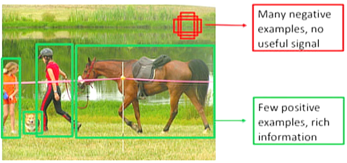
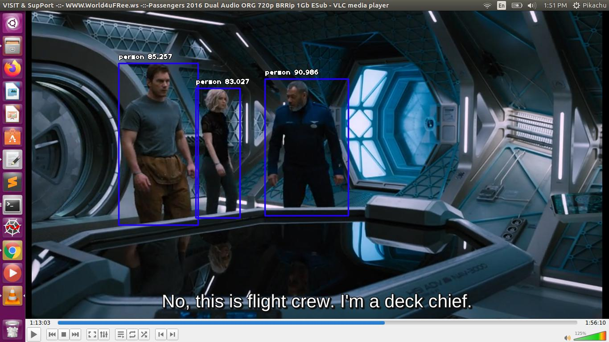

# Object-Detection-classifier-using-Image_ai
Beginner's Guide to Object Detection Algorithms 
 
**@author: Akash Kumar** 
**https://www.linkedin.com/in/akash-kumar-9b87b5148/**  
Object Detection is used almost everywhere these days. The use cases are endless, be it Tracking objects, Video surveillance, Pedestrian detection, Anomaly detection, People Counting, Self-driving cars or Face detection, the list goes on.
  

**ImageAI** provided very powerful yet easy to use classes and functions to perform Video Object Detection and Tracking and Video analysis. ImageAI allows you to perform all of these with state-of-the-art deep learning algorithms like **RetinaNet**, **YOLOv3** and **TinyYOLOv3**. With ImageAI you can run detection tasks and analyse videos and live-video feeds from device cameras and IP cameras. 
  
In my file I have used **RetinaNet** 
What is RetinaNet ?  
It is discovered that there is extreme foreground-background class imbalance problem in **one-stage detector**. And it is believed that this is the central cause which makes the performance of one-stage detectors inferior to **two-stage detectors**.
In **RetinaNet**, an one-stage detector, by using **focal loss, lower loss** is contributed by “easy” negative samples so that the loss is focusing on “hard” samples, which improves the prediction accuracy.  
 
 **Number of Boxes Comparison in different Algorithm**  
<ol><li>YOLOv1: 98 boxes</li>
<li>YOLOv2: ~1k</li>
<li>OverFeat: ~1–2k</li>
<li>SSD: ~8–26k</li>
<li>RetinaNet: ~100k.</li>
  </ol>
  
   
   
  In this model i used **COCO DATASET** to train our model
  **COCO MODEL** 
   
  The **Common Objects in Context (COCO)** dataset has **200,000 images** with more than **500,000** object annotations in 80 categories. It is the most extensive publicly available object detection database. The average number of objects is **7.2 per image**. 
    
### OUTPUT
   
  <video width="320" height="240" autoplay>
  <source src="camera_detected_video.avi"  >
 
</video>
  
  
